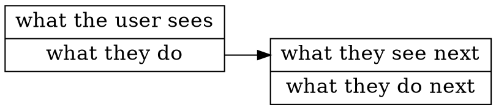

# uiflows-parser

[ui-spec-md](https://github.com/pxgrid/ui-spec-md)のUI Flowsのコードブロックをパースする部分を抜き出したもの。


## Usage

### want this


### sample script

```javascript
const uiflowsParser = require( 'uiflows-parser' );

const uiflowsStr = `
[what the user sees]
what they do
==> what they see next

[what they see next]
what they do next
`;

uiflowsParser(uiflowsStr);
```


### the return (dot lang)



would be to good pass the return to [Viz.js](https://github.com/mdaines/viz.js/).


## Other examples

- [uiflows-convert-png](https://github.com/pxgrid/uiflows-convert-png)'s [./index.js](https://github.com/pxgrid/uiflows-convert-png/blob/master/index.js)
- [ui-spec-md](https://github.com/pxgrid/ui-spec-md)'s [./lib/UiflowsMDRenderer.js](https://github.com/pxgrid/ui-spec-md/blob/v0.2.x/lib/UiflowsMDRenderer.js)

